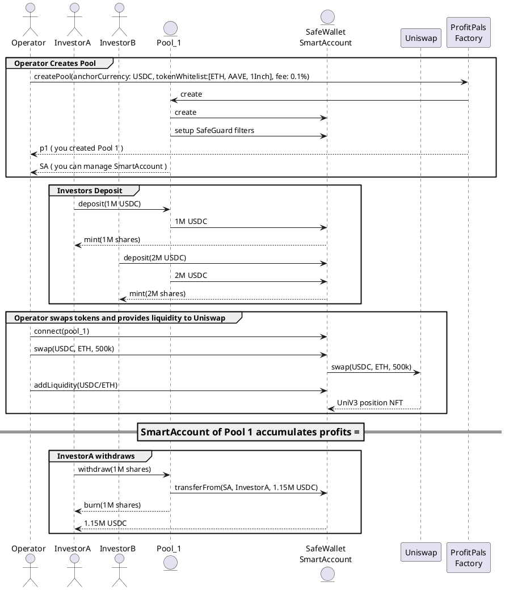

```plantuml
@startuml
actor Operator
actor InvestorA
actor InvestorB


entity "Pool_1" as p1
entity "SafeWallet\nSmartAccount" as SA
participant Uniswap
participant "ProfitPals\nFactory" as factory


group Operator Creates Pool
Operator -> factory : createPool(anchorCurrency: USDC, tokenWhitelist:[ETH, AAVE, 1Inch], fee: 0.1%)
factory -> p1 : create
p1 -> SA : create
p1 -> SA : setup SafeGuard filters
Operator <-- factory: p1 ( you created Pool 1 )
Operator <-- p1: SA ( you can manage SmartAccount )
end

group Investors Deposit
InvestorA -> p1: deposit(1M USDC)
p1 -> SA: 1M USDC
InvestorA <-- SA: mint(1M shares)

InvestorB -> SA: deposit(2M USDC)
p1 -> SA: 2M USDC
InvestorB <-- SA: mint(2M shares)
end

group Operator swaps tokens and provides liquidity to Uniswap
Operator -> SA: connect(pool_1)

Operator -> SA: swap(USDC, ETH, 500k)
SA -> Uniswap: swap(USDC, ETH, 500k)
Operator -> SA: addLiquidity(USDC/ETH)
SA <-- Uniswap: UniV3 position NFT
end

=== SmartAccount of Pool 1 accumulates profits ===

group InvestorA withdraws
InvestorA -> p1: withdraw(1M shares)
p1 -> SA: transferFrom(SA, InvestorA, 1.15M USDC)
InvestorA <-- p1: burn(1M shares)
InvestorA <-- SA: 1.15M USDC
end
@enduml
```